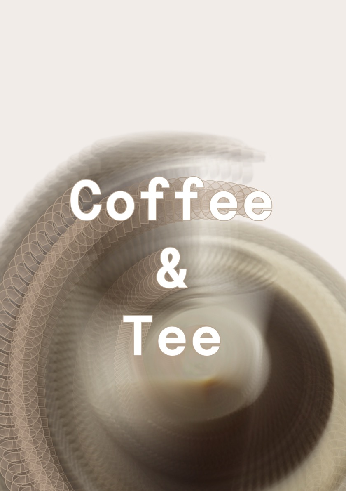
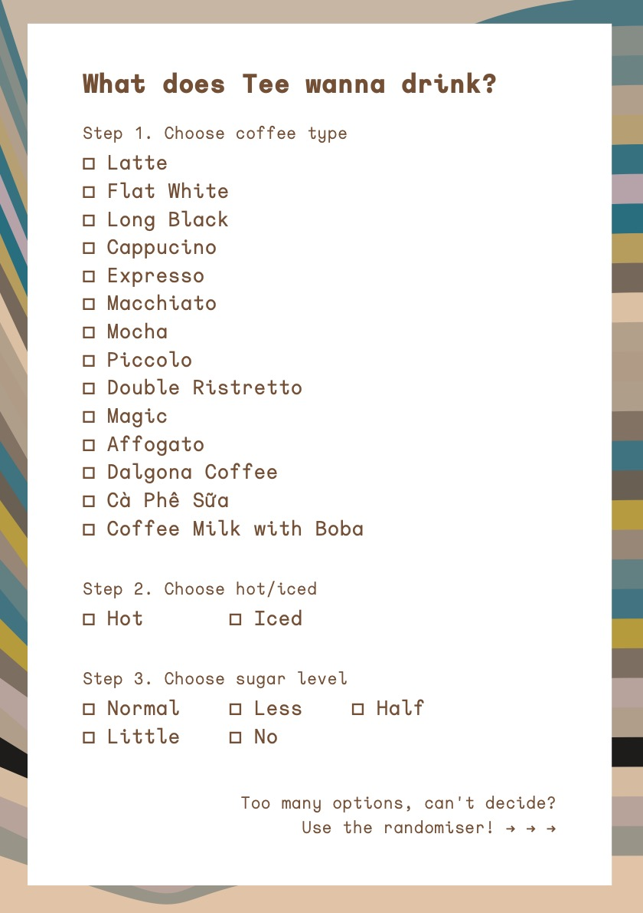
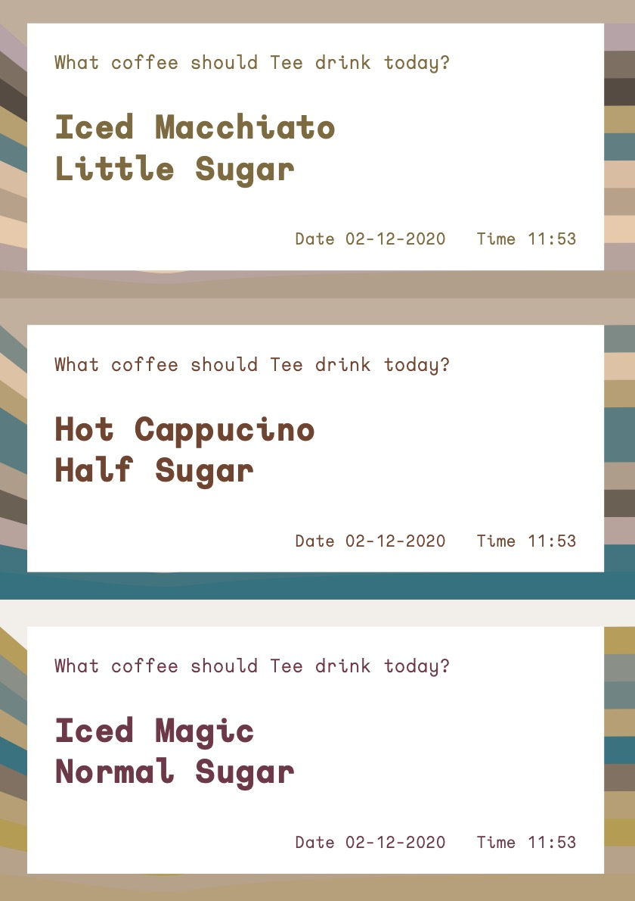
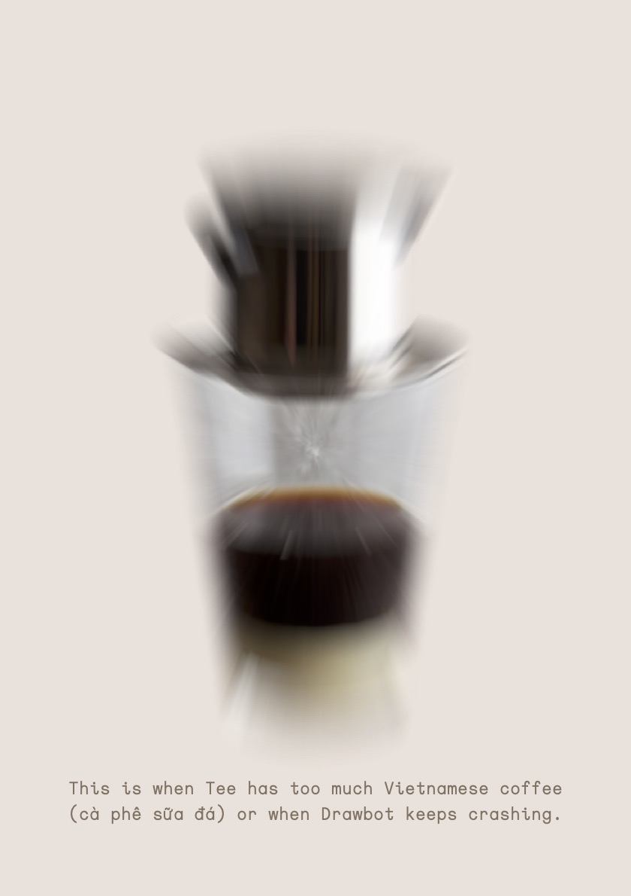
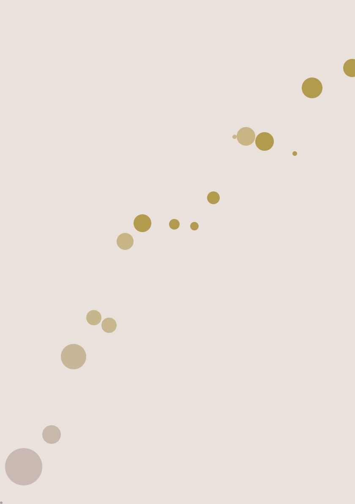

# Coffee and Tee (A5 Zine)
### From DJR's class 'Python for Visual Designers' (Type@Cooper) 

Wow, it's been 1.5 months since I have got my hands on writing Python code and using DrawBot. Can't thank you enough to David and my classmates who I only met them online :( Hopefully, there will be one day I can meet them in real life.

The idea of this zine is about 'Coffee'. Normally, our class sessions started at 7PM (US time) which is around 10AM-11AM in my Melbourne time (Australia). No one had coffee except me so I came up with the 'Coffee' theme. 

#### Page 1 - Cover

#### Page 2 - Coffee-addict spiral

#### Page 3 - Coffee list

#### Page 4 - Coffee randomiser (refresh to get more random choices)

#### Page 5 - Cà phê phin

#### Page 6 - Coffee Spill

